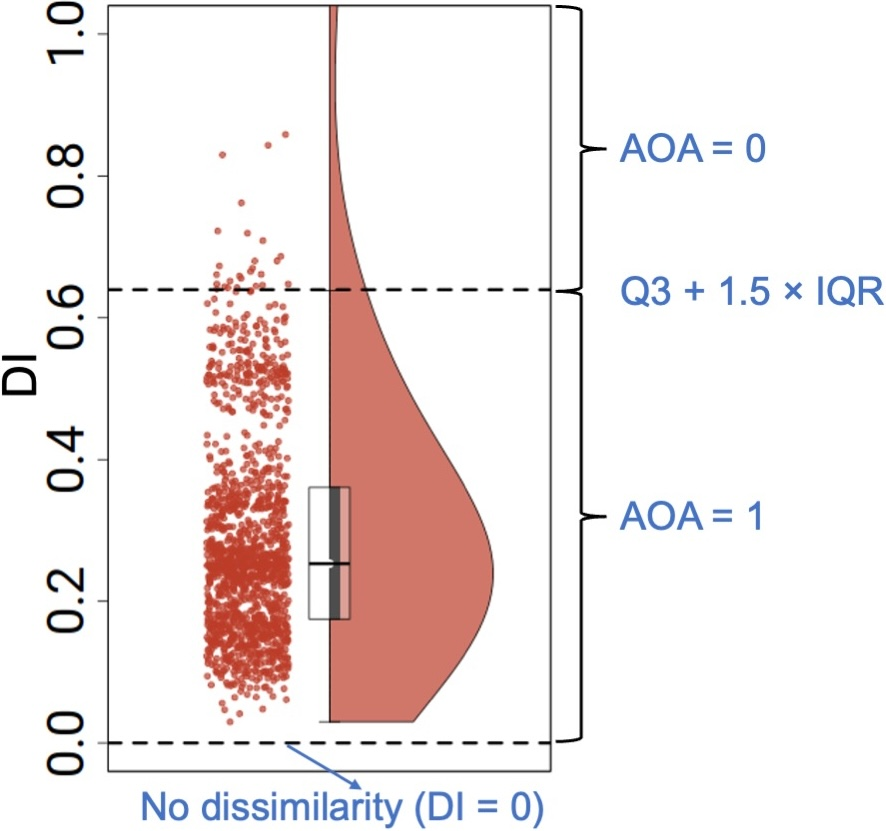

# Assessing the area of applicability of machine learning models for spatial soil moisture prediction in southeastern Australia

[](https://opensource.org/licenses/MIT)
[](https://www.r-project.org/)
[]()
[](https://twitter.com/yuyi13_phd)

## Contents

- [Overview](#overview)
- [Background](#background)
- [The AOA concept](#the-aoa-concept)
- [Demo](#demo)
- [Experimental scripts](#experimental-scripts)
- [Figure scripts](#figure-scripts)
- [Permalink](#permalink)
- [How to cite](#how-to-cite)
- [References](#references)

## Overview

This repository is structured to support reproducible research for "Spatial soil moisture prediction from in-situ data upscaled to Landsat footprint: Assessing area of applicability of machine learning models" (Yu et al., 2025). It presents the assessment of the area of applicability (AOA) of two machine learning (ML) models for spatial soil moisture (SM) prediction extrapolated from the OzNet Hydrological Monitoring Network in Yanco, Australia. The [demo](#demo) provides the functionality of AOA determination of the trained models. The [experimental](#experimental-scripts) and [figure](#figure-scripts) scripts are for reference purposes only.

## Background

The inherent spatial mismatch between satellite-derived and ground-observed near-surface SM data necessitates cautious interpretation of point-to-pixel comparisons. While data-driven upscaling of point-scale SM enables statistically sound comparisons, it often lacks uncertainty quantification for the reliable spatial extent estimates of implemented models. Considering that all upscaling strategies inherently carry nonnegligible errors (Crow et al., 2012), and are potentially influenced by spatial autocorrelation, it is crucial to assess the spatial distribution of error magnitudes and extrapolate the applicability of SM prediction at a relatively broader spatial scale. Emerging spatial analysis tools, such as the AOA metric (Meyer and Pebesma, 2021), which describes the spatial region where a prediction model is expected to maintain cross-validation performance, offer the capability of quantifying these spatial uncertainties.

The Yanco agricultural region (146.00-147.00 °E and 34.30-35.30 °S; 100 km × 100 km) was designated as the study area. Yanco is situated within the Murrumbidgee Catchment, with a Mediterranean climate that is representative for the majority of agricultural regions in southeastern Australia (i.e., hot dry summer and cool moist winter). The AOA assessment is also extended to a broader region (144.50-147.50 °E and 33.00-36.00 °S; 300 km × 300 km) to fully explore the prediction capabilities of trained ML models.

<p>


<em>The study area</em>
<p>

<p>


<em>The extended area</em>
<p>

## The AOA concept

The AOA concept (Meyer and Pebesma, 2021) serves as a tool to evaluate the spatial extent within which a ML model can be reliably applied. In spatial prediction studies, ML models are typically trained using spatially distributed data obtained from ground stations. However, the model needs to make prediction in new geographic areas, which may possess different feature combinations and relationships to those present in the model training data. 

AOA delineates the area where the model can reliably apply relationships learned from training data, ensuring that the estimated cross-validation performance remains valid. This binary metric is determined using a dissimilarity index (DI), which quantifies how different a prediction location's characteristics are from training locations.

DI values range from 0 to $\infty$, where:

- `DI = 0` represents identical characteristics between prediction and training locations;
- `DI = Q3 + 1.5 * IQR` represents the outlier-removed threshold (i.e., the upper whisker of a box plot), below which the prediction locations are considered sufficiently similar with the training locations (i.e., AOA = 1).

<p>


<em>An illustration of DI and AOA</em>
<p>

## Demo

A demonstration script with sample data is provided to illustrate the functionality of AOA. Make sure you are at the dir `OzNet_AOA`, then simply run:

```
Rscript 1_aoa_demo/demo.R
```

This minimal implementation demonstrates:
1. Train a XGB model based on a 4-fold spatial cross-validation, and compute the trained dissimilarity index (TDI);
2. Apply TDI to spatial predictor variables to determine AOA and DI;
3. Visualise the spatial distribution of SM prediction, DI and AOA.

You should get an output like this:

```
DI:
class       : SpatRaster 
dimensions  : 1000, 1000, 1  (nrow, ncol, nlyr)
resolution  : 0.001, 0.001  (x, y)
extent      : 146, 147, -35.3, -34.3  (xmin, xmax, ymin, ymax)
coord. ref. : lon/lat WGS 84 (EPSG:4326) 
source(s)   : memory
name        :           DI 
min value   :  0.001927745 
max value   : 12.045685165 

AOA:
class       : SpatRaster 
dimensions  : 1000, 1000, 1  (nrow, ncol, nlyr)
resolution  : 0.001, 0.001  (x, y)
extent      : 146, 147, -35.3, -34.3  (xmin, xmax, ymin, ymax)
coord. ref. : lon/lat WGS 84 (EPSG:4326) 
source(s)   : memory
name        : AOA 
min value   :   0 
max value   :   1 


Predictor Weights:
         dem         awc     clay       silt       sand   lst_100m albedo_100m
1 0.08307054 0.009389059 0.042892 0.06679434 0.02102157 0.03341171    0.145537
  ndvi_100m    et_100m       tavg       vpd       srad       rain
1 0.1774103 0.08794802 0.02423263 0.2397983 0.03552223 0.03297235


AOA Threshold: 0.3445035
```

This will also generate a visualisation `fig_aoa_demo.jpg` in the directory `figures/`:

<p>


<em>The Spatial distribution of SM prediction, DI and AOA</em>
<p>

## Experimental scripts

These scripts describe the experimental design implemented in the paper. These scripts are categorised by:

1. Spatiotemporal fusion of multi-resolution predictor variables to generate downscaled data;
2. Spatial SM prediction using clustered SM data from 28 in-situ stations, with different spatial cross-validation strategies;
3. Assessment of AOA of two ML models, representing the spatial extent within which the ML models can be reliably applied;
4. Evaluations against multiple independent SM observations from field campaigns, different networks, and satellite retrievals.

Due to computational requirements and data dependencies, these scripts are provided for reference purposes only and are not directly executable. They serve as a methodological blueprint for implementing the approach in other contexts or with alternative datasets.

<p>


<em>Experimental design</em>
<p>

## Figure scripts

This directory provides the scripts to reproduce figures in the article. With the absence of input data, they are also not runnable and for reference purposes only though.

## Permalink

The experimental data to support reproducible research is publicly available from the CSIRO Data Access Portal (https://doi.org/xxxxx/xxxxx).

This repository has a permalink registered at [Zenodo](https://doi.org/xx.xxxx/zenodo.xxxxxxx).

## How to cite

```
@article{YU2025_OzNet_AOA,
author = {Yi Yu and Brendan P. Malone and Luigi J. Renzullo and Chad A. Burton and Siyuan Tian and Ross D. Searle and Thomas F. A. Bishop and Jeffrey P. Walker},
title = {Spatial soil moisture prediction from in-situ data upscaled to Landsat footprint: Assessing area of applicability of machine learning models},
journal = {IEEE Transactions on Geoscience and Remote Sensing},
volume = {},
pages = {},
year = {2025},
doi = {}
}
```

## Conference paper

Yu, Y., Malone, B. P. and Renzullo, L. J., 2024. Empirical upscaling of point-scale soil moisture measurements for spatial evaluation of model simulations and satellite retrievals, *2024 IEEE International Geoscience and Remote Sensing Symposium (IGARSS 2024), Athens, Greece, 7-12 July*. https://doi.org/10.1109/IGARSS53475.2024.10642763

## References

Crow, W. T., Berg, A. A., Cosh, M. H., Loew, A., Mohanty, B. P., Panciera, R., de Rosnay, P., Ryu, D., Walker, J. P., 2012. Upscaling sparse ground-based soil moisture observations for the validation of coarse-resolution satellite soil moisture products. *Reviews of Geophysics, 50*. https://doi.org/10.1029/2011rg000372

Meyer, H., and Pebesma, E., 2021. Predicting into unknown space? Estimating the area of applicability of spatial prediction models. *Methods in Ecology and Evolution, 12(9)*, 1620-1633. https://doi.org/10.1111/2041-210X.13650
